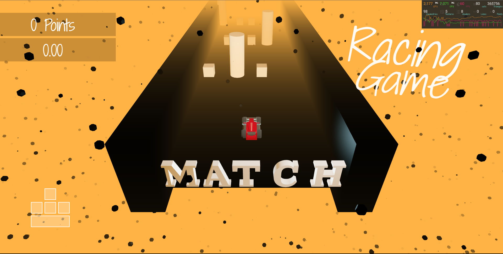

# Racing Car Game with React Three Drei and Fiber 💪🚗

Experience the adrenaline rush of driving fast cars on challenging tracks in React Car Racing 3D, a game that leverages the power of React Three Fiber and Drei to render stunning 3D scenes and animations. It provides a 3D web game where you can experience the following features:

1. Choose a different car with different engine power 🚗.
2. Amazing time and attention-based 3D game (minimum collisions with obstacles in a certain time) ⌛.
3. Wonderful scenes with lots of effects ✨🌠.
4. Clean architect components can be reused in other projects 📦.

### Tools and Libraries used

- [Cannon js](https://github.com/pmndrs/cannon-es) to simulate the physics and collisions of the game, such as the gravity, friction, and force of the cars 💥.

- [Drei](https://github.com/pmndrs/drei) to add useful components and helpers to the game, such as cameras, controls, effects, loaders, and shaders 📷.

- [React Three Fiber](https://github.com/pmndrs/react-three-fiber) to create 3D models and scenes for the game, such as the car, the track, the sky, and the lights 💡.

- [Zustand](https://zustand-demo.pmnd.rs/) to create logic and state management of the game ➕.

### Next Features

- Different maps and obstacles with effects 🛣️.

- Variant obstacles with the ability to choose game difficulty and add game levels 🪨.

- More cars and effects 🏎️.

- ...

### Motivation

Fascinated by [Bruno Simon](https://github.com/brunosimon) tutorial and decided to follow it step by step. I learned a lot from his explanations and demonstrations.

### Contributions

I appreciate your interest in the project! If you have any feedback, suggestions, or resources related to the game, please feel free to share.

Thank you!